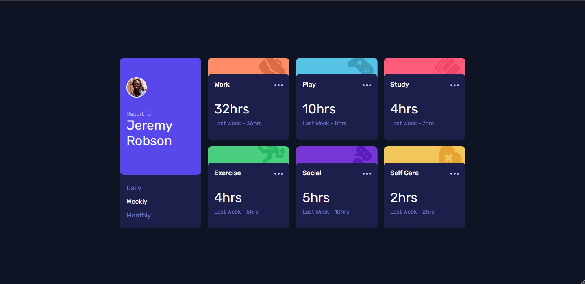
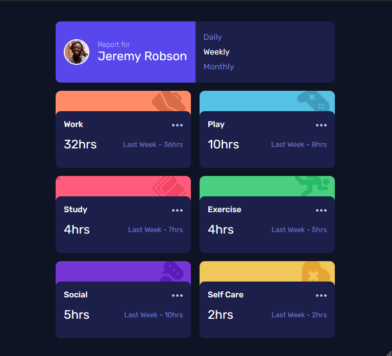
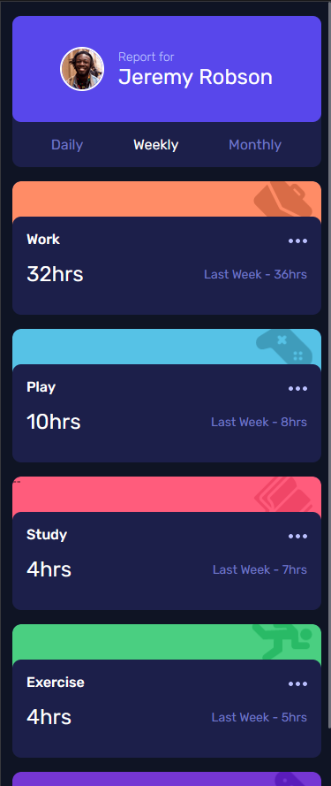

# Frontend Mentor - Time tracking dashboard solution

This is a solution to the [Time tracking dashboard challenge on Frontend Mentor](https://www.frontendmentor.io/challenges/time-tracking-dashboard-UIQ7167Jw). Frontend Mentor challenges help you improve your coding skills by building realistic projects. 

## Table of contents

- [The challenge](#the-challenge)
- [Screenshot](#screenshot)
- [Links](#links)
- [My process](#my-process)
- [Built with](#built-with)
- [What I learned](#what-i-learned)
- [Continued development](#continued-development)
- [Author](#author)

### The challenge

Users should be able to:

- View the optimal layout for the site depending on their device's screen size
- See hover states for all interactive elements on the page
- Switch between viewing Daily, Weekly, and Monthly stats

### Screenshot

### Links

- Solution URL: [GitHub Repository](https://github.com/cellbesmanos/fm-time-tracking-dashboard)
- Live Site URL: [Live Site](https://fervent-feynman-980e10.netlify.app/)

## My process

- Built the basic HTML structure
- Established the responsiveness of the dashboard
- Styled the profile card
- Styled the stats card
- Created the script

### Built with

- Semantic HTML5 markup
- CSS custom properties
- Flexbox
- CSS Grid
- Mobile-first workflow
- Asyncronous Javascript

### What I learned

- I learned that site or component responsiveness should be established first, especially for complex components like this
- It is fast to make your CSS lengthy
- Retrieving data is fun

### Continued development

- Refactor the CSS code using SCSS for better debugging.
- Improve HTML structure specifically for the background images for stats card
- Refactor Javascript for robust data extraction regardless of the order

## Author

- Frontend Mentor - [@cellbesmanos](https://www.frontendmentor.io/profile/cellbesmanos)

